# Gun Violence Incident Analysis in R

This repository is a cleaned portfolio version of my ALY6040 Data Mining final project at Northeastern University.

I used a public U.S. gun violence dataset to study patterns in incidents from January 2013 to March 2018. My goal was to understand where incidents were more common, when they happened more often, what participant patterns showed up, and how well different models could identify higher-casualty incidents.

This repo is meant to be easy for HR, interviewers, and GitHub visitors to read. I kept the main story simple, but I also kept the original files so the project still feels real and traceable.

---

## Project Snapshot

- **Course:** ALY6040 - Data Mining
- **Project type:** Individual course project
- **Language:** R
- **Dataset:** Gun Violence Dataset from Kaggle
- **Time range:** January 2013 to March 2018
- **Data size:** 239,677 rows, 29 columns
- **Main work:** data cleaning, EDA, participant-series parsing, word cloud analysis, feature engineering, model comparison, report writing

---

## Business Problem

This project started from four main questions:

1. What factors may predict more severe incidents?
2. Are there times of the year when incidents happen more often?
3. Which incidents are more likely to have multiple casualties?
4. How do local factors connect to high incident rates in some states?

So this project was not only about summary charts. It also included a basic predictive modeling task.

---

## My Role

This was an individual project.

I completed the analysis and report on my own. My main work included:

- cleaning the dataset
- checking missing values and duplicates
- building time-based features
- analyzing location and participant patterns
- parsing multi-value participant fields
- creating word clouds from location descriptions
- building and comparing models
- writing the final report

I also reviewed Kaggle notebooks and discussion posts to improve my ideas for handling the dataset and model testing.

See:
- [Contribution note](contribution-note.md)
- [Individual reflection](archive/reflection/individual-reflection.pdf)

---

## Tools and Methods

### Tools
- R
- tidyverse
- lubridate
- ggplot2
- splitstackshape
- tidytext
- wordcloud
- caret
- fastDummies
- randomForest

### Methods
- data cleaning
- missing value review
- outlier checking
- exploratory data analysis
- participant-series parsing
- text mining with word clouds
- feature engineering
- train/test split
- model comparison

### Models tested
- Logistic Regression
- KNN
- LightGBM
- Random Forest

---

## Project Workflow

1. Load the dataset  
2. Review data types, unique values, missing values, and duplicates  
3. Explore outliers in `n_killed` and `n_injured`  
4. Create year, quarter, month, and weekday features  
5. Analyze incidents by state, city, month, quarter, and weekday  
6. Parse participant-related string fields into usable rows  
7. Build word clouds from `location_description`  
8. Create `total_casualties`  
9. Create `high_casualty` as a binary target  
10. Test several models  
11. Compare results and write recommendations  

---

## Selected Visuals

### Time Patterns

<p align="center">
  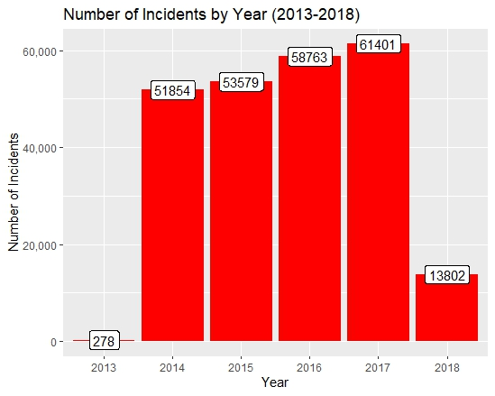
  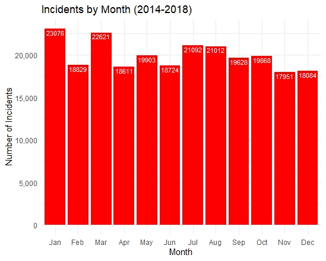
</p>

<p align="center">
  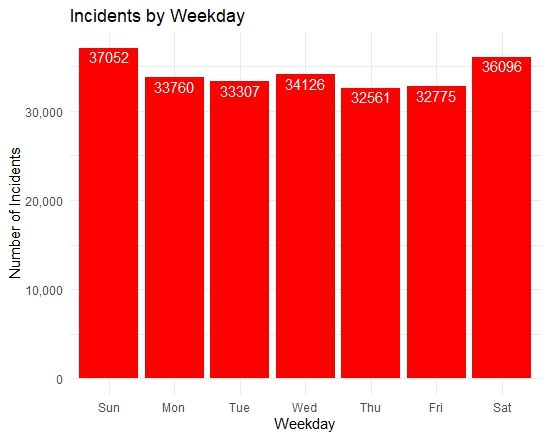
  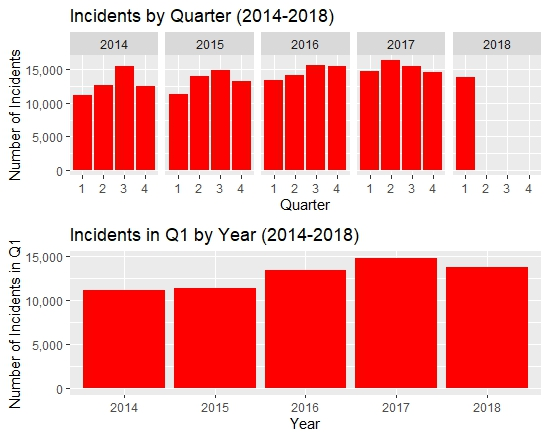
</p>

### Geography Patterns

<p align="center">
  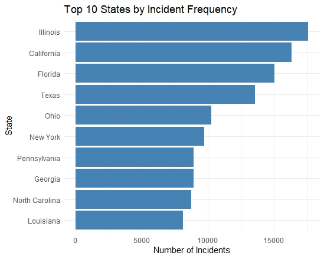
  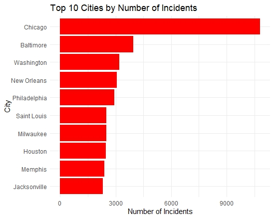
</p>

<p align="center">
  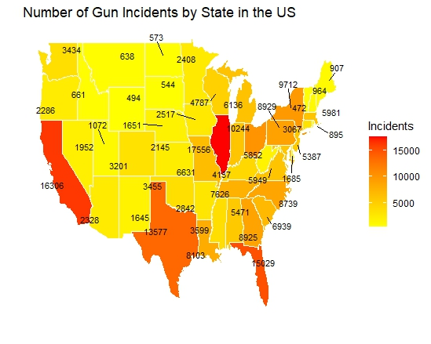
</p>

### Participant and Text Patterns

<p align="center">
  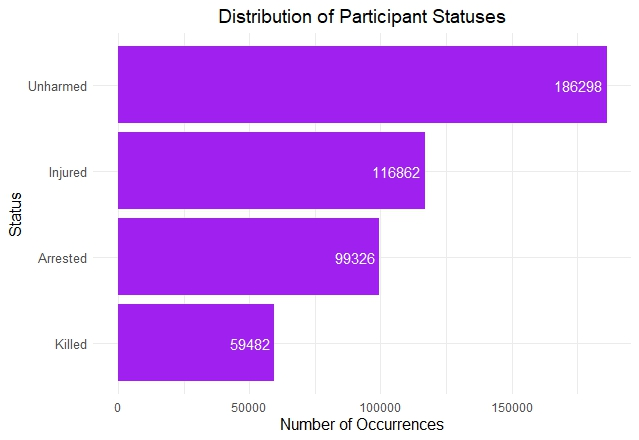
  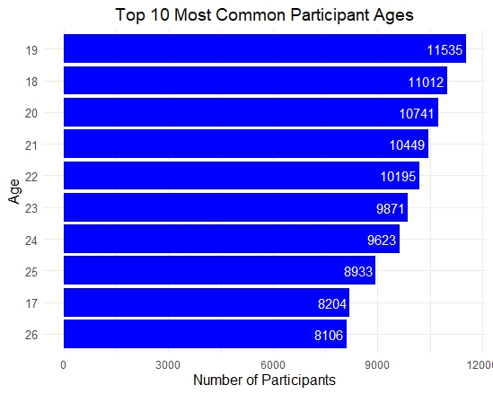
</p>

<p align="center">
  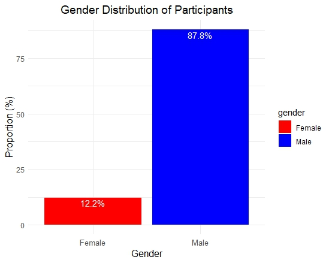
  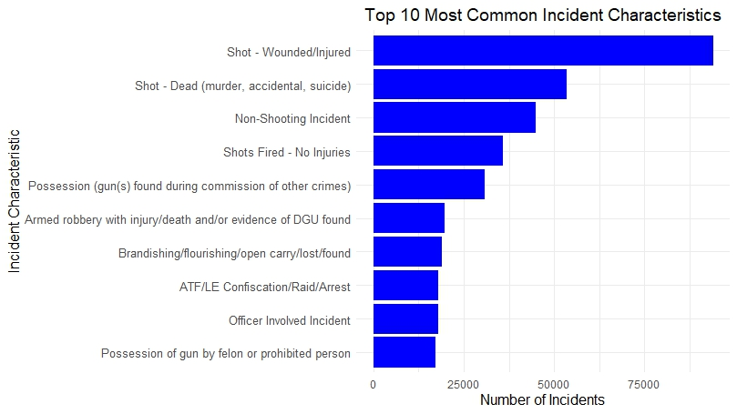
</p>

<p align="center">
  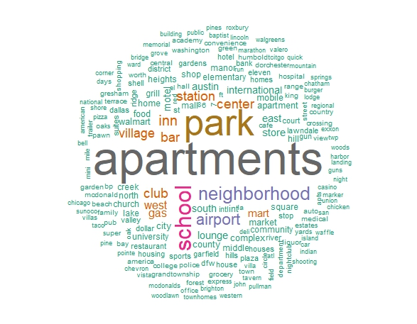
  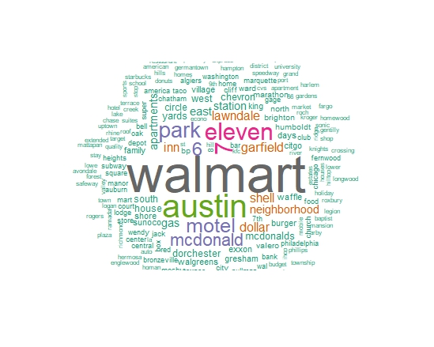
</p>

---

## Key Findings

### 1. Incident counts increased from 2014 to 2017
The yearly trend showed a steady increase before the partial 2018 period.

### 2. Time patterns were clear
Incidents were more frequent on weekends, especially Sunday and Saturday. January, March, and summer months also showed higher counts.

### 3. Geographic concentration was strong
Illinois, California, Florida, and Texas had high incident counts. Chicago stood out as the top city.

### 4. Participant patterns were also strong
Many participants were marked as unharmed, injured, or arrested. The most common ages were around 18 to 26, and most participants were male.

### 5. Location descriptions gave extra context
Common words like apartments, parks, schools, and neighborhoods showed up often in the word cloud analysis.

---

## Modeling Note

To represent incident severity, I created:

```r
gun_data_encoded$total_casualties <- gun_data_encoded$n_killed + gun_data_encoded$n_injured
gun_data_encoded$high_casualty <- ifelse(gun_data_encoded$total_casualties >= 3, 1, 0)
```

I tested Logistic Regression, KNN, LightGBM, and Random Forest.

For this public GitHub version, I use the **final report version** as the main modeling reference, because it is the most complete written version and it matches the main R workflow more closely.

### Main takeaway
Random Forest was the strongest model among the tested options, but the class imbalance problem was still serious.

### Final report metrics used here
- **Accuracy:** 97.45%
- **Precision:** 86.67%
- **Recall:** 2.94%
- **F1 Score:** 5.68%

### What this means
The model looked strong on accuracy, but it still missed many true high-casualty incidents. So the model was useful as a learning result, but not strong enough for a real decision system.

<p align="center">
  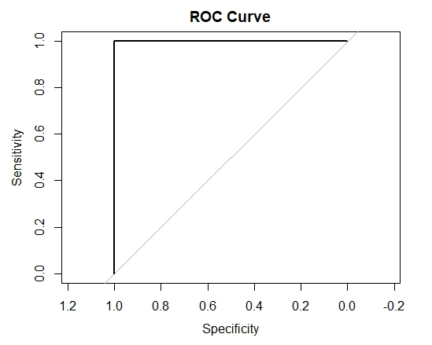
  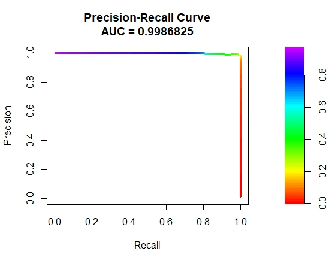
</p>

### Important note
Some values shown in the original presentation slides are much higher than the final report version. I keep the slide deck in this repo as an original course artifact, but the public project summary here follows the final report and original script more conservatively.

---

## Limitations

This project has some clear limitations:

- strong class imbalance in the target
- missing values in several columns
- limited external context variables
- some model versions took a long time to run
- some slide materials reflect an earlier or different experiment version and should not be treated as the final public reference

---

## Repository Structure

```text
gun-violence-incident-analysis-r/
├─ README.md
├─ contribution-note.md
├─ data/
│  └─ README.md
├─ scripts/
│  ├─ 01_full_analysis.R
│  ├─ 02_final_report_source.Rmd
│  ├─ README.md
│  └─ packages-used.md
├─ walkthrough/
│  └─ project-walkthrough.md
├─ outputs/
│  ├─ README.md
│  └─ figures/
│     ├─ selected/
│     └─ full-set/
├─ reports/
│  ├─ final-report.pdf
│  └─ portfolio-project-summary.pdf
├─ slides/
│  └─ original-presentation.pdf
└─ archive/
   ├─ README.md
   ├─ reflection/
   │  └─ individual-reflection.pdf
   └─ model-output/
      └─ model-output.txt
```

---

## Files to Read First

If you want the shortest path through this repo, I suggest this order:

1. [Project walkthrough](walkthrough/project-walkthrough.md)
2. [Portfolio project summary PDF](reports/portfolio-project-summary.pdf)
3. [Original final report](reports/final-report.pdf)
4. [Selected figures](outputs/figures/selected/)
5. [Full R analysis script](scripts/01_full_analysis.R)
6. [Dataset note](data/README.md)

---

## Dataset Note

The main dataset used in this project is the **Gun Violence Dataset** from Kaggle.

The original analysis script uses a local CSV path. In this public repo, I do not require the raw dataset to be committed by default.

Please check:
- [Dataset note](data/README.md)

---

## Original Project Materials

This repository keeps both a cleaner portfolio version and original course materials.

### Main public reading path
- [Project walkthrough](walkthrough/project-walkthrough.md)
- [Portfolio project summary PDF](reports/portfolio-project-summary.pdf)
- [Selected figures](outputs/figures/selected/)

### Original course materials
- [Final report](reports/final-report.pdf)
- [Original presentation slides](slides/original-presentation.pdf)
- [Original analysis script](scripts/01_full_analysis.R)
- [Original model output](archive/model-output/model-output.txt)
- [Individual reflection](archive/reflection/individual-reflection.pdf)

---

## Short Interview Version

This was my individual final project for a data mining course. I used a U.S. gun violence dataset in R to study time, location, and participant patterns, and I also tested models for higher-casualty incident prediction. The main value of the project was the full workflow: cleaning data, parsing complex fields, finding useful EDA patterns, and then honestly evaluating the limits of the model instead of only showing a high accuracy number.