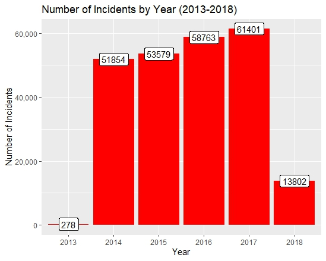
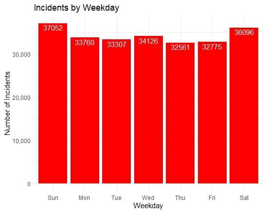
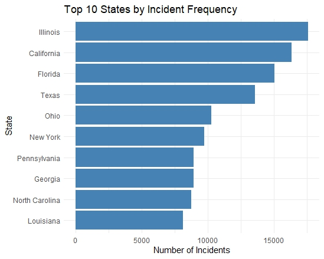
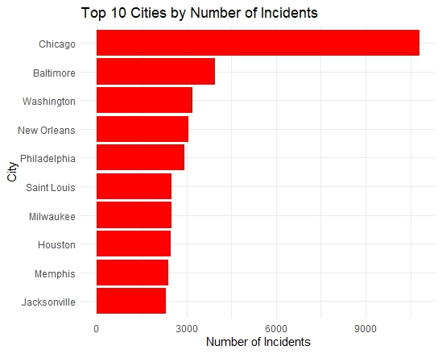
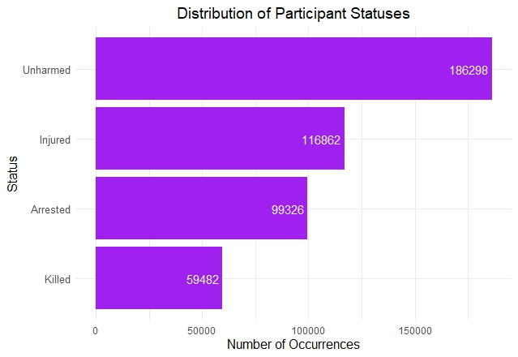
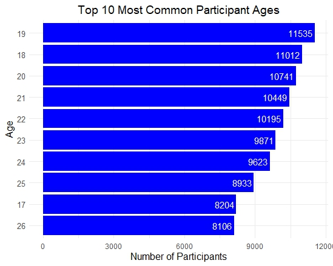
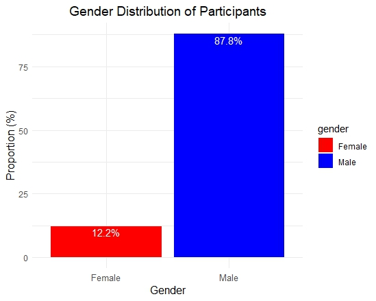
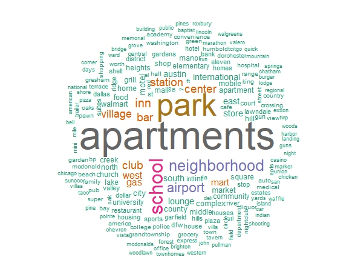

# Gun Violence Incident Analysis in R

## Short Summary

This project analyzes public U.S. gun violence incident data from January 2013 to March 2018 using R. The goal was to study where incidents were more common, when higher counts appeared, what participant patterns were visible, and how carefully a simple model could be evaluated for higher-casualty incidents.

This is a cleaned portfolio version of my ALY6040 Data Mining final project at Northeastern University. It is best understood as an individual R data mining and exploratory analytics project, not as a production prediction system.

## Project Type / Status / Tools

- **Project type:** Individual course-based R data mining project
- **Portfolio category:** R statistical / business analytics project
- **Status:** Coursework project organized for portfolio review
- **Dataset:** Kaggle Gun Violence Dataset
- **Time range:** January 2013 to March 2018
- **Data size:** 239,677 rows and 29 columns
- **Main tools:** R, tidyverse, lubridate, ggplot2, splitstackshape, tidytext, wordcloud, caret, fastDummies, randomForest, xgboost
- **Main work:** data cleaning, missingness review, outlier checks, time-feature engineering, participant-field parsing, text exploration, EDA, and cautious model evaluation

## Business Problem

Gun violence incident data can be difficult to read directly because it contains many rows, messy participant fields, location details, and outcome variables. This project uses the data as a public-safety analytics exercise: turn a large incident table into clear patterns that a public-safety analyst, policy researcher, or portfolio reviewer could understand.

The main questions were:

1. What observed factors are connected with more severe incidents?
2. Are incident counts higher during certain months, quarters, or weekdays?
3. Which incidents are more likely to have multiple casualties?
4. How do state, city, and local fields relate to high incident counts?

These are descriptive and predictive analytics questions. They should not be read as causal claims or policy-validated findings.

## Project Objective

The objective was to build a full R analysis workflow:

- inspect and clean a large public dataset
- create date and severity features
- parse multi-value participant fields
- visualize time, location, participant, and incident-type patterns
- explore location text with word clouds
- test classification models for a high-casualty target
- explain why high model accuracy can still be misleading when the target class is rare

## Dataset

The project uses the Kaggle Gun Violence Dataset.

- **Main file expected locally:** `data/raw/gun-violence-data_01-2013_03-2018.csv`
- **Granularity:** one row per incident
- **Rows / columns:** 239,677 rows and 29 columns
- **Time period:** January 2013 to March 2018
- **Target created for modeling:** `high_casualty = 1` when `n_killed + n_injured >= 3`

The raw CSV is not intended to be redistributed in this public portfolio repo. See [data/README.md](data/README.md) for the data access note and [data/data-dictionary.md](data/data-dictionary.md) for the working column dictionary.

## My Role / Contribution

This was an individual course-based project. I completed the analysis and report on my own, then reorganized the materials into a cleaner portfolio format.

My work included:

- cleaning the dataset and checking missing values, duplicates, and outliers
- creating time-based features such as year, quarter, month, and weekday
- creating `total_casualties` and `high_casualty`
- analyzing state, city, month, quarter, weekday, and participant patterns
- parsing multi-value participant fields
- creating word clouds from `location_description`
- building and comparing classification model experiments
- writing the final report and preparing presentation materials

See [contribution-note.md](contribution-note.md) and [archive/reflection/individual-reflection.pdf](archive/reflection/individual-reflection.pdf).

## Methodology

The analysis followed this workflow:

1. Load the incident-level CSV.
2. Review data types, unique values, missing values, and duplicate rows.
3. Check outliers in `n_killed` and `n_injured`.
4. Create year, quarter, month, day, and weekday fields from `date`.
5. Analyze incident counts by state, city, month, quarter, and weekday.
6. Parse participant status, type, age, and gender fields from multi-value strings.
7. Explore `location_description` text using word clouds.
8. Create `total_casualties` and the binary `high_casualty` target.
9. One-hot encode selected categorical features.
10. Split the data into training and testing sets.
11. Test model experiments and interpret the final Random Forest reference carefully.

The main analysis is in [scripts/01_full_analysis.R](scripts/01_full_analysis.R). The report source is in [scripts/02_final_report_source.Rmd](scripts/02_final_report_source.Rmd).

## Key Findings

- **Incident counts increased from 2014 to 2017.** The 2018 period is partial because the dataset only runs through March 2018.
- **Weekend counts were higher.** Sunday and Saturday had the highest weekday counts in the selected chart.
- **Some months had higher counts.** January, March, July, and August stood out in the monthly view.
- **Incident counts were geographically concentrated.** Illinois, California, Florida, and Texas had high raw incident counts, and Chicago stood out at the city level.
- **Participant fields showed clear patterns.** Many participants were marked as unharmed, injured, or arrested. Common ages were around 18 to 26, and most parsed gender records were male.
- **Location text added context.** Words such as apartments, parks, schools, and neighborhoods appeared often in the location-description word clouds.
- **The model result needs caution.** The final Random Forest reference showed high overall accuracy but very weak recall for high-casualty incidents.

These findings are based on observed incident counts in the dataset. The state and city charts show raw counts, not per-capita risk.

## Visual Highlights

### Time Patterns

<p align="center">
  
  
</p>

The yearly chart shows the main incident-count trend, while the weekday chart shows higher counts on Sunday and Saturday.

### Geography Patterns

<p align="center">
  
  
</p>

These charts show raw incident counts by state and city. They should not be interpreted as per-capita comparisons.

### Participant and Text Patterns

<p align="center">
  
  
</p>

<p align="center">
  
  
</p>

These visuals summarize participant and text patterns after parsing the original string fields.

## Model Evaluation Note

To represent incident severity, I created:

```r
gun_data_encoded$total_casualties <- gun_data_encoded$n_killed + gun_data_encoded$n_injured
gun_data_encoded$high_casualty <- ifelse(gun_data_encoded$total_casualties >= 3, 1, 0)
```

The checked-in script includes Random Forest, KNN, and XGBoost sections. The final report and archived notes also discuss Logistic Regression and LightGBM experiments.

For this public portfolio version, the safest model reference is the final Random Forest result from the final report and archived model output:

- **Accuracy:** 97.45%
- **Precision:** 86.67%
- **Recall:** 2.94%
- **F1 Score:** 5.68%

The main lesson is that accuracy alone is misleading. The model predicted the majority class well, but it missed many true high-casualty incidents. This should be treated as a coursework classification experiment, not an operational prediction system.

Some original slide materials show much stronger model metrics from an earlier version of the work. I keep those slides as original course artifacts, but the public README uses the more conservative final report metrics.

## Repository Structure

| Path | Purpose |
|---|---|
| [README.md](README.md) | Main project overview |
| [walkthrough/project-walkthrough.md](walkthrough/project-walkthrough.md) | More detailed project walkthrough |
| [contribution-note.md](contribution-note.md) | Individual contribution note |
| [data/README.md](data/README.md) | Data access and reproduction note |
| [data/data-dictionary.md](data/data-dictionary.md) | Working data dictionary |
| [scripts/01_full_analysis.R](scripts/01_full_analysis.R) | Main R analysis script |
| [scripts/02_final_report_source.Rmd](scripts/02_final_report_source.Rmd) | R Markdown source for the final report |
| [scripts/packages-used.md](scripts/packages-used.md) | Practical package list |
| [reports/final-report.pdf](reports/final-report.pdf) | Original final course report |
| [reports/portfolio-project-summary.pdf](reports/portfolio-project-summary.pdf) | Shorter portfolio summary PDF |
| [slides/original-presentation.pdf](slides/original-presentation.pdf) | Original course presentation slides |
| [archive/model-output/model-output.txt](archive/model-output/model-output.txt) | Saved model-output notes |
| [outputs/figures/selected/](outputs/figures/selected/) | Selected charts for portfolio review |

## How to Reproduce

1. Download the Kaggle Gun Violence Dataset.
2. Save the CSV locally as:

   `data/raw/gun-violence-data_01-2013_03-2018.csv`

3. Install the packages listed in [scripts/packages-used.md](scripts/packages-used.md).
4. Open and run [scripts/01_full_analysis.R](scripts/01_full_analysis.R).

The repository keeps the original course workflow rather than a production-style pipeline. Exact package versions were not locked during the original submission.

## Limitations

This project has several important limitations:

- It was an individual course and portfolio project, not a production system.
- No real stakeholder engagement, policy validation, deployment, dashboard, SQL layer, GenAI component, or MLOps workflow is included.
- The findings are descriptive and should not be presented as causal.
- State and city charts use raw incident counts, not per-capita rates.
- Several fields have missing values, especially some participant, location-description, gun, and relationship fields.
- The `high_casualty` target is rare, creating strong class imbalance.
- The final Random Forest recall was very weak, so the model is not reliable for flagging high-casualty incidents.
- Some original slide metrics are much higher than the final report metrics and should be treated as earlier course artifacts.
- Any model version that directly or indirectly uses `n_killed` or `n_injured` as predictors for a target derived from those fields would create leakage risk.

## Future Improvements

Future improvements would include:

- add a cleaner reproducibility setup with package versions
- add a compact missingness and target-distribution table to the documentation
- normalize geographic charts by population for per-capita comparison
- improve model evaluation with a clear baseline, stratified split, class weighting or SMOTE, and threshold tuning
- focus model evaluation on recall, precision-recall tradeoffs, and false-negative cost
- separate the original course artifacts from the final public portfolio story more clearly
- optionally add a small dashboard or Shiny app later, if the goal becomes interactive exploration

## Related Files

- [walkthrough/project-walkthrough.md](walkthrough/project-walkthrough.md) - detailed project walkthrough
- [data/README.md](data/README.md) - data access and reproduction note
- [data/data-dictionary.md](data/data-dictionary.md) - working column dictionary
- [scripts/01_full_analysis.R](scripts/01_full_analysis.R) - main R analysis script
- [scripts/02_final_report_source.Rmd](scripts/02_final_report_source.Rmd) - report source
- [scripts/packages-used.md](scripts/packages-used.md) - practical package list
- [reports/final-report.pdf](reports/final-report.pdf) - original final report
- [reports/portfolio-project-summary.pdf](reports/portfolio-project-summary.pdf) - shorter portfolio summary PDF
- [outputs/figures/selected/](outputs/figures/selected/) - selected visual outputs
- [archive/model-output/model-output.txt](archive/model-output/model-output.txt) - archived model-output notes
